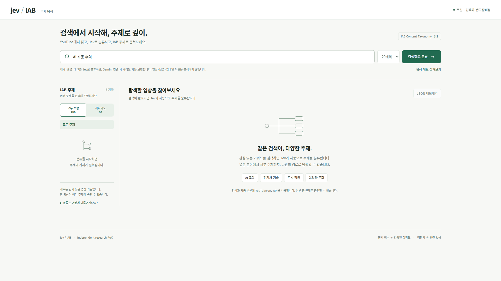

# Jev IAB Explorer

**Search YouTube. Explore by topic.**

A Korean-language video explorer that uses the Jev API to classify YouTube search results into IAB Content Taxonomy 3.1 topics.

## Curate by topic and purpose

[](assets/readme/ai-income-curation-live.gif)

Search **“AI 자동 수익”** (AI automated income), then combine **Business and Finance AND Personal Finance**: 17 collected videos become 2. Selecting **“수익화 전략 및 조언”** (monetization strategy and advice) leaves 1, with its raw Jev scores and purpose definition available in the detail panel.

*Full HD capture of live YouTube, Gemini, and Jev responses. Waiting periods are shortened. Gemini-generated purpose names and matching videos vary by search; partial evaluations remain visible.*

[Still image](assets/readme/ai-income-curation-live.png) · [Purpose scores](assets/readme/ai-income-purpose-detail.png) · [Capture data](assets/readme/ai-income-curation-live.json) · [Architecture](docs/ARCHITECTURE.md)

- **Automatic classification** — Search once and classify each result using its title, description, and tags.
- **Combine topics** — Select multiple IAB topics with AND/OR matching, with scrolling up to 100 videos.
- **Discover viewing purposes** — Start with five common purposes. Gemini proposes missing purposes from search metadata; Jev evaluates them and adds matching filters.
- **Continue partial results** — Reuse earlier scores and explore skipped IAB branches with a per-video call budget.
- **Inspect the evidence** — Review scores and evaluation scope, add transcript evidence, and export results as JSON.

Select IAB topics in the sidebar, choose **AND** (all selected topics) or **OR** (any selected topic), then add a viewing-purpose filter. Multiple purposes match with OR; the topic and purpose groups must both match. Filters apply to collected videos and pause automatic pagination. **합성 데모 살펴보기** provides an offline example.

## Inside a classification

The detail panel connects each video to its IAB category paths, raw Jev scores, and derived path scores. This frame from the earlier workflow automation capture also shows partial evaluation and the recommendation to add transcript evidence.

[](assets/readme/workflow-automation-detail.png)

<details>
<summary>View evaluation scope and model provenance</summary>

The evaluation view shows assessed categories, budget limits, and the model, taxonomy, and rubric versions. Unvisited categories remain unassessed; supplied metadata is evidence, not an independently verified explanation.

[](assets/readme/workflow-automation-evaluation.png)

</details>

## Quick start

Requires Node.js 22 or later. Try the synthetic demo without API keys:

```bash
git clone https://github.com/ziwon/jev-iab-explorer.git
cd jev-iab-explorer
npm run demo
```

Open [localhost:8790](http://localhost:8790) and select **합성 데모 살펴보기**. Demo data and scores are synthetic.

For live search and classification, stop the demo server and create the local configuration:

```bash
npm run init:local
```

Set `TYPESAFE_API_KEY` and `YOUTUBE_API_KEY` in `.dev.vars`, then run `npm run dev`. Add `GEMINI_API_KEY` to enable adaptive purposes; `GEMINI_MODEL` defaults to `gemini-2.5-flash`. All keys stay on the server; live requests use provider quota. Restart the local server after changing configuration.

## How it works

Public metadata is evaluated first. When evidence is insufficient, transcripts can supplement the classification. Video, audio, and thumbnail pixels are not analyzed. Raw scores are not calibrated accuracy measurements; path scores are heuristics, and unassessed categories remain unknown.

Initial purposes and separate topic/purpose evidence checks share one Jev request. With Gemini configured, the first batch containing purpose abstentions automatically triggers discovery from up to 20 collected videos. New definitions include inclusion/exclusion criteria and exact metadata quotes; Jev evaluates their applicability across collected results. **목적 보완** can extend the catalog as more videos arrive, up to eight additional purposes. A proposal does not guarantee a matching video or remove abstention.

**이어서 분류** explores skipped IAB branches using existing evidence and scores, with at most 4 or 12 additional Jev attempts per video. It does not automatically fetch captions or assess omitted transcript segments. Details and exports retain previous outputs, raw scores, and model/rubric provenance. Resume state expires after six hours and is excluded from exports. Transcript purposes describe assessed segments, not the entire video.

## Tests

```bash
npm test
npm run test:python
```

Tests run without API keys or external requests. Python is required for the Python tests.

---

[MIT License](LICENSE) · Independent research PoC
