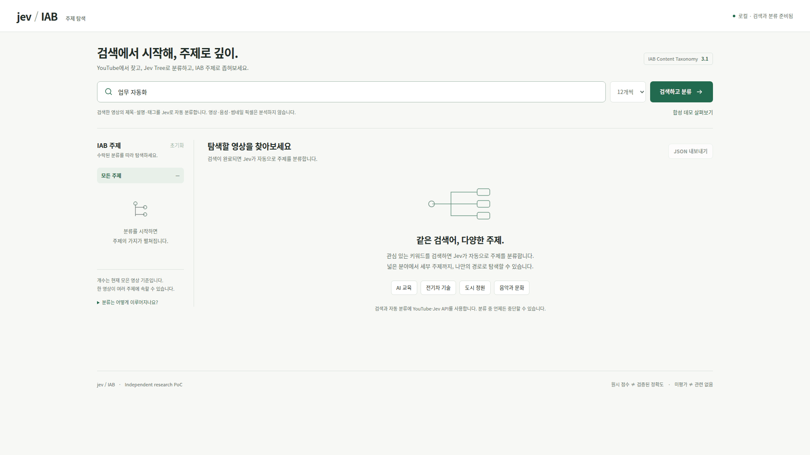

# Jev IAB Explorer

**Search YouTube. Explore by topic.**

A Korean-language video explorer that uses the Jev API to classify YouTube search results into IAB Content Taxonomy 3.1 topics.



*Live search for “업무 자동화” (workflow automation), captured in Full HD. Waiting periods are shortened; partial results remain visible.*

[Still image](assets/readme/workflow-automation-live.png) · [Capture data](assets/readme/workflow-automation-live.json) · [Architecture](docs/ARCHITECTURE.md)

- **Automatic classification** — Search once and classify each result using its title, description, and tags.
- **Topic-based browsing** — Explore hierarchical IAB filters and multiple labels, with scrolling up to 100 videos.
- **Inspect the evidence** — Review scores and evaluation scope, add transcript evidence, and export results as JSON.

## Inside a classification

The detail panel connects each video to its IAB category paths, raw Jev scores, and derived path scores. This original frame from the live run above also shows partial evaluation and the recommendation to add transcript evidence.

[](assets/readme/workflow-automation-detail.png)

<details>
<summary>View evaluation scope and model provenance</summary>

The evaluation view shows assessed categories, budget limits, and the model, taxonomy, and rubric versions. Unvisited categories remain unassessed; supplied metadata is evidence, not an independently verified explanation.

[](assets/readme/workflow-automation-evaluation.png)

</details>

## Quick start

Requires Node.js 22 or later. Try the synthetic demo without API keys:

```bash
git clone https://github.com/ziwon/jev-iab-explorer.git
cd jev-iab-explorer
npm run demo
```

Open [localhost:8790](http://localhost:8790) and select **합성 데모 살펴보기**. Demo data and scores are synthetic.

For live search and classification, stop the demo server and create the local configuration:

```bash
npm run init:local
```

Set `TYPESAFE_API_KEY` and `YOUTUBE_API_KEY` in `.dev.vars`, then run `npm run dev`. Keys stay on the server; live requests use provider quota.

## How it works

Public metadata is evaluated first. When evidence is insufficient, transcripts can supplement the classification. Video, audio, and thumbnail pixels are not analyzed. Raw scores are not calibrated accuracy measurements; path scores are heuristics, and unassessed categories remain unknown.

## Tests

```bash
npm test
npm run test:python
```

Tests run without API keys or external requests. Python is required for the Python tests.

---

[MIT License](LICENSE) · Independent research PoC
